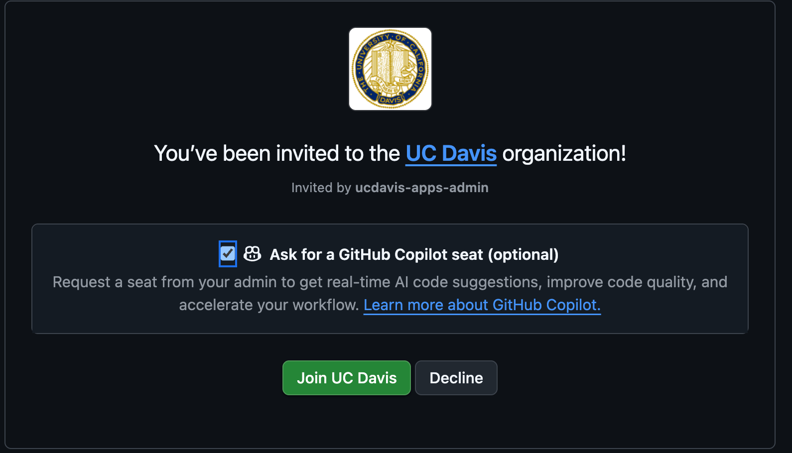
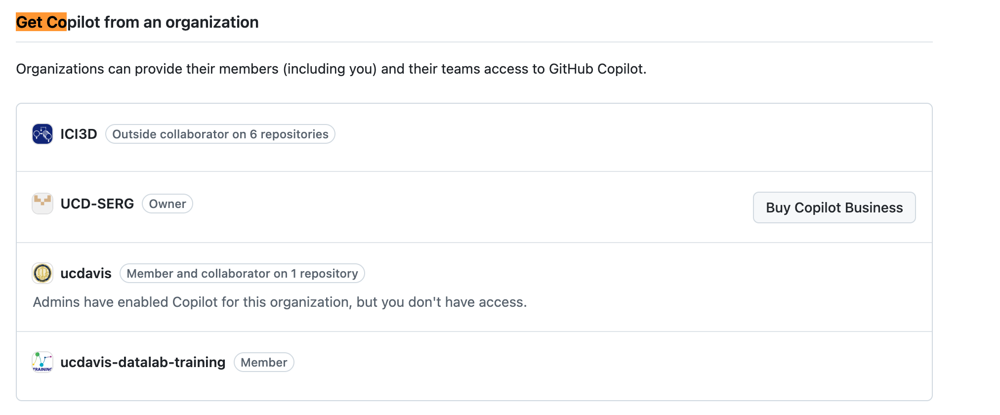

# Github {#sec-github}

This chapter has moved to
[*Principles of Scientific Computing*](https://morrison-lab.github.io/psc/),
the Morrison Lab's general-purpose guide to coding for research projects:
**[Git and GitHub](https://morrison-lab.github.io/psc/chapters/github.html)**
(source: <https://github.com/Morrison-Lab/psc>).

[]{#sec-cli-tools}
[]{#sec-dev-branches}
[]{#sec-export-cautions}
[]{#sec-export-conversations}
[]{#sec-export-gh}
[]{#sec-export-graphql}
[]{#sec-export-migration}
[]{#sec-export-rest}
[]{#sec-export-three-streams}
[]{#sec-git-gui-clients}
[]{#sec-gitattributes}
[]{#sec-github-desktop}
[]{#sec-gitkraken}
[]{#sec-gitkraken-kepler}
[]{#sec-gitlab}
[]{#sec-install-gh}
[]{#sec-install-glab}
[]{#sec-removing-sensitive-data}

That page covers:

- [Basics](https://morrison-lab.github.io/psc/chapters/github.html)
- [Graphical Git Clients](https://morrison-lab.github.io/psc/chapters/github.html#sec-git-gui-clients)
- [GitHub CLI and GitLab CLI](https://morrison-lab.github.io/psc/chapters/github.html#sec-cli-tools)
- [Git Branching](https://morrison-lab.github.io/psc/chapters/github.html)
- [Personal Dev Branches](https://morrison-lab.github.io/psc/chapters/github.html#sec-dev-branches)
- [Example Workflow](https://morrison-lab.github.io/psc/chapters/github.html)
- [Pull Request Roles and Protocol](https://morrison-lab.github.io/psc/chapters/github.html)
- [Commonly Used Git Commands](https://morrison-lab.github.io/psc/chapters/github.html)
- [How often should I commit?](https://morrison-lab.github.io/psc/chapters/github.html)
- [Repeated Amend Workflow](https://morrison-lab.github.io/psc/chapters/github.html)
- [What should be pushed to Github?](https://morrison-lab.github.io/psc/chapters/github.html)
- [GitLab](https://morrison-lab.github.io/psc/chapters/github.html#sec-gitlab)
- [Customizing How Files Appear on GitHub](https://morrison-lab.github.io/psc/chapters/github.html#sec-gitattributes)
- [Exporting Issue and Pull Request Conversations](https://morrison-lab.github.io/psc/chapters/github.html#sec-export-conversations)
- [Removing Sensitive Data from a Repository](https://morrison-lab.github.io/psc/chapters/github.html#sec-removing-sensitive-data)

::: {.callout-note collapse="true"}
## Looking for a specific section that used to be here?

This chapter's old section anchors still resolve on this page,
so old bookmarks and links won't 404,
but the content now lives on the page linked above,
under the same anchor.
For example, `#sec-foo` here is `github.html#sec-foo` there.
:::

## GitHub Education and Copilot Access {#sec-github-education}

### GitHub Education Benefits

Students, faculty, and researchers at UC Davis can access GitHub Education benefits,
which include free access to GitHub Pro features and various developer tools.

**To sign up for GitHub Education:**

1. Visit the [GitHub Education website](https://education.github.com/)
2. Click "Get benefits" or "Join GitHub Education"
3. Sign in with your GitHub account (or create one if you don't have one)
4. Complete the application form using your UC Davis email address (ending in `ucdavis.edu`)
5. Provide proof of your academic affiliation (e.g., upload a photo of your student ID or university letter)
6. Wait for approval (typically takes a few days)

Once approved,
you'll have access to the [GitHub Student Developer Pack](https://education.github.com/pack) (for students)
or [GitHub Teacher Toolbox](https://education.github.com/teachers) (for faculty),
which includes numerous free tools and services for learning and development.

### GitHub Copilot Access for UC Davis Members

GitHub Copilot is an AI-powered coding assistant that can significantly accelerate your work.
As a member of the UC Davis GitHub organization,
you may be eligible for a free Copilot seat.

**To request a Copilot seat:**

**If you are not yet a member of the UC Davis GitHub organization:**

1. Ensure you have a GitHub account and have signed up for GitHub Education (see above)
2. Go to the [UC Davis IT ServiceHub GitHub page](https://servicehub.ucdavis.edu/servicehub?id=it_catalog_content&sys_id=951add951b5798103f4286ae6e4bcb12)
3. Click the blue "Get GitHub!" button near the top right
4. When you receive the invitation email,
   make sure to check the "Ask for a GitHub Copilot seat (optional)" checkbox before joining (@fig-request-copilot-seat)

:::{#fig-request-copilot-seat}

UC Davis GitHub invitation with Copilot seat option
:::

5. Click "Join UC Davis" to accept the invitation
6. Follow the setup instructions to install and configure Copilot in your development environment

**If you are already a member of the UC Davis GitHub organization:**

1. Go to your [GitHub Copilot settings](https://github.com/settings/copilot/features)
2. Scroll to the "Get Copilot from an organization" section at the bottom
3. Find the "ucdavis" entry and click the request button

:::{#fig-copilot-settings-org-options}

GitHub Copilot settings page showing organization options

:::

4. Wait for approval from the UC Davis GitHub organization administrators
5. Once approved,
   follow the setup instructions to install and configure Copilot in your development environment

For guidance on using GitHub Copilot effectively,
see the [wai site's "Best Practices for Safe and Successful Use" section](https://morrison-lab.github.io/wai/chapters/coding-agents.html#sec-ai-best-practices).
